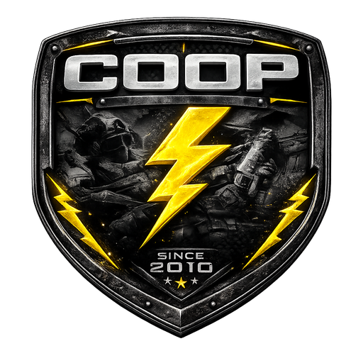

<p align="center">
  
</p>

<h1 align="center">Painel Tático COOP</h1>

<p align="center">
  <strong>Sistema de gestão operacional para corporações policiais/militares de roleplay</strong>
</p>

<p align="center">
  
  
  
  
  
  
  
</p>

---

## 📋 Sobre o Projeto

O **Painel Tático COOP** é um sistema completo de comando e controle projetado para gerenciar operações, efetivo, treinamento e comunicação interna de uma corporação policial/militar. Desenvolvido com foco em **hierarquia**, **controle de acesso granular por patente** e **experiência premium**.

---

## ⚙️ Módulos

| Módulo | Descrição |
|---|---|
| **Dashboard** | Visão geral com métricas em tempo real do efetivo e operações |
| **PTR (Relatórios)** | Patrulhamento Tático — criação de viaturas, escalas e registro de ocorrências |
| **Prisional** | Registro de prisões com fichas detalhadas, fotos do preso e participantes |
| **Corregedoria** | Processos disciplinares internos com acompanhamento de status |
| **Ausências** | Solicitação e aprovação de afastamentos com controle por patente |
| **Subdivisões** | Gestão de unidades especializadas (BOPE, ROTA, etc.) com comandantes e operadores |
| **Cursos** | Criação de cursos de capacitação com apostilas e conclusão certificada |
| **Informativos** | Publicação de diretrizes oficiais e orientações ao efetivo |
| **Exonerações** | Controle de desligamentos da corporação |
| **Comunidade** | Rede social interna com posts, vídeos, curtidas e comentários |
| **Chat** | Bate-papo em tempo real estilo Discord com envio de imagens e moderação |
| **Gestão de Militares** | Aprovação de cadastros, promoções e controle de status |
| **Permissões** | Configuração granular de acesso por patente para todos os módulos |
| **Métricas** | Análise de desempenho com gráficos e KPIs |
| **Perfil** | Página pessoal com avatar, capa, tags de cursos e subdivisões |

---

## 🔐 Hierarquia Militar

O sistema reconhece **15 patentes** com controle de permissão em cascata:

```
Coronel → Ten. Coronel → Major → Capitão → 1º Tenente → 2º Tenente
→ Aspirante → Subtenente → 1º Sargento → 2º Sargento → 3º Sargento
→ Cabo → 1º Soldado → 2º Soldado → Aluno Soldado
```

- **Coronel e Ten. Coronel** possuem acesso total e podem configurar permissões de todas as patentes
- Cada patente possui um **ícone/brasão SVG exclusivo** renderizado em todo o sistema

---

## 🛠️ Stack Tecnológica

```
Frontend       React 18 + TypeScript + Vite + Tailwind CSS
Backend        Express.js (Serverless Functions na Vercel)
Banco de Dados Firebase Firestore (NoSQL em tempo real)
Upload         Cloudinary (avatares, capas, fotos de prisões, chat)
Autenticação   JWT com cookies httpOnly
Deploy         Vercel (frontend estático + API serverless)
```

---

## 🚀 Deploy na Vercel

### 1. Clone o repositório
```bash
git clone https://github.com/Igor0Wilson/painel-policia-front.git
cd painel-policia-front
```

### 2. Instale as dependências
```bash
npm install
```

### 3. Configure as variáveis de ambiente

Copie o `.env.example` e preencha com seus valores:

```bash
cp .env.example .env
```

| Variável | Descrição |
|---|---|
| `FIREBASE_API_KEY` | Chave da API do Firebase |
| `FIREBASE_AUTH_DOMAIN` | Auth domain do Firebase |
| `FIREBASE_PROJECT_ID` | ID do projeto Firebase |
| `FIREBASE_STORAGE_BUCKET` | Bucket de storage |
| `FIREBASE_MESSAGING_SENDER_ID` | Sender ID |
| `FIREBASE_APP_ID` | App ID |
| `FIREBASE_MEASUREMENT_ID` | Measurement ID (Analytics) |
| `JWT_SECRET` | String secreta longa para assinar tokens |
| `CLOUDINARY_CLOUD_NAME` | Nome do cloud no Cloudinary |
| `CLOUDINARY_API_KEY` | API Key do Cloudinary |
| `CLOUDINARY_API_SECRET` | API Secret do Cloudinary |
| `ALLOWED_ORIGIN` | URL do deploy (ex: `https://seu-projeto.vercel.app`) |

### 4. Rode localmente
```bash
# Terminal 1 — Frontend
npm run dev

# Terminal 2 — Backend
npm run dev:backend
```

### 5. Deploy para produção
```bash
git add .
git commit -m "deploy"
git push
```

> A Vercel detecta automaticamente o Vite + as Serverless Functions em `api/` e faz o deploy.
> Após o primeiro deploy, adicione todas as variáveis de ambiente em **Vercel → Settings → Environment Variables**.

---

## 📁 Estrutura do Projeto

```
├── api/
│   ├── index.ts          # Entry point do Express (Serverless Function)
│   ├── routes.ts         # Todas as rotas da API
│   └── firebase.ts       # Abstração do Firestore + fallback local
├── public/
│   └── logo.png          # Logo da corporação
├── src/
│   ├── components/       # Sidebar, Header, RankIcon
│   ├── context/          # AuthContext (autenticação global)
│   ├── pages/            # Todos os módulos do sistema
│   ├── App.tsx           # Roteamento principal
│   ├── main.tsx          # Entry point React
│   └── index.css         # Design system (Tailwind + custom)
├── vercel.json           # Configuração de deploy
├── .env.example          # Template de variáveis de ambiente
└── package.json
```

---

## 🎨 Design

- **Dark mode premium** com paleta `zinc-950` e acentos em amarelo/dourado
- **Glassmorphism** e micro-animações em toda a interface
- **Tipografia**: Inter + Outfit (Google Fonts)
- **Ícones**: Lucide React
- **Brasões de patente**: SVGs customizados renderizados inline
- **Layout responsivo**: Sidebar colapsável + header mobile

---

## 📄 Licença

Projeto privado. Todos os direitos reservados.

---

<p align="center">
  <sub>Desenvolvido com ☕ para a corporação <strong>COOP</strong></sub>
</p>
